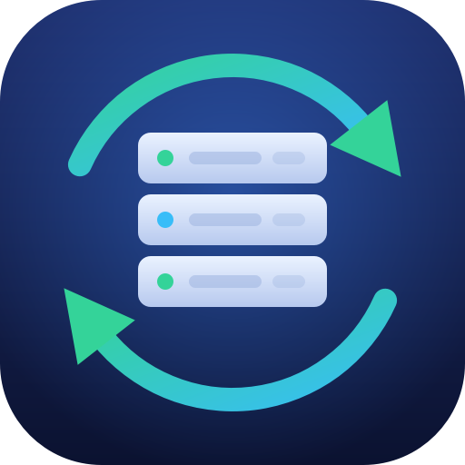
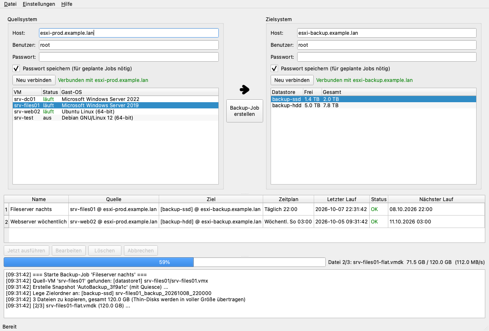

<p align="center">
  
</p>

<h1 align="center">ESXi Auto Backupper</h1>

<p align="center">
  Sichert laufende VMs von einem ESXi-Host auf einen anderen – automatisch und regelmäßig.<br>
  Ersatz für den manuellen Weg über den VMware vCenter Converter Standalone.
</p>

<p align="center">
  <a href="https://github.com/fmatsch/esxi-auto-backupper/releases/latest"><b>⬇ Download (Windows .exe)</b></a> ·
  <a href="https://fmatsch.ist/esxi-auto-backupper/">Webseite</a>
</p>



*(Screenshot mit Beispieldaten)*

## Was die App macht

Pro Backup: Snapshot auf der Quell-VM (die VM läuft weiter) → Kopie der VM-Dateien
über diesen PC auf den Ziel-Datastore → angepasste VMX (Name, Hardware-Profil,
neue MAC/UUID) → VM wird auf dem Ziel-Host **ausgeschaltet** registriert →
Snapshot wird entfernt → alte Backups werden nach Aufbewahrungsregel gelöscht.

- Läuft unter **Windows 10/11**, arbeitet mit **ESXi 7.0 und 8.0** (Standalone-Hosts, kein vCenter nötig)
- **Quelle links, Ziel rechts**, ein Klick zum Job
- **Hardware-Standardprofil** (CPU, RAM, Netzwerk-Zuordnung, MAC/UUID) für alle künftigen Jobs, pro Job überschreibbar
- **Zeitpläne:** manuell, alle N Stunden, täglich, wöchentlich – in der App oder über den Windows-Taskplaner
- **Kostenlose ESXi-Lizenz** wird unterstützt: Die API ist dort read-only, die App weicht automatisch auf SSH aus
- **Aufbewahrung:** die letzten N Backups bleiben, ältere werden gelöscht (laufende VMs nie)
- Aufräumen bei Fehlern (Snapshot weg, halbfertiger Zielordner weg), Sperre gegen doppelte Läufe
- Passwörter liegen im **Windows-Credential-Manager**, nie in der Konfigurationsdatei

## Installation

1. Auf der Seite [Releases](https://github.com/fmatsch/esxi-auto-backupper/releases/latest) `EsxiBackupper.exe` herunterladen und starten – keine Installation nötig.
2. `EsxiBackupperCli.exe` ist die Konsolenversion für den Taskplaner (`--run-job <id>`).
3. Die SHA-256-Prüfsummen stehen in `SHA256SUMS.txt` beim Release.

> **Hinweis zu Windows SmartScreen:** Die Dateien sind nicht code-signiert. Windows warnt
> deshalb beim ersten Start („Der Computer wurde durch Windows geschützt“) –
> „Weitere Informationen → Trotzdem ausführen“. Die Exe wird bei jedem Release
> öffentlich in GitHub Actions aus dem Quellcode in diesem Repository gebaut.

## Bedienung

1. **Links (Quellsystem):** ESXi-Host eintragen, verbinden, VM auswählen.
2. **Rechts (Zielsystem):** Ziel-Host verbinden, Datastore auswählen.
3. **„Backup-Job erstellen“:** Name, Zeitplan, Aufbewahrung und ggf. abweichende Hardware festlegen.
4. **Einstellungen → Hardware-Standardprofil:** Vorlage für alle *zukünftigen* Jobs.

Jobs laufen automatisch, solange die App geöffnet ist. Optional wird ein Job im
**Windows-Taskplaner** registriert (Checkbox im Job-Dialog) – dann läuft er auch ohne
offene App; die App überspringt solche Jobs, damit nichts doppelt läuft.
„Passwort speichern“ beim Verbinden ist für geplante Jobs erforderlich.

Backups heißen `<Namenspräfix>_backup_<Zeitstempel>`. Das Präfix ist standardmäßig der VM-Name;
die Aufbewahrung räumt alle ausgeschalteten VMs mit diesem Präfix auf dem Ziel auf – bei
mehreren Jobs also **unterschiedliche Präfixe** verwenden, wenn sie auf denselben Ziel-Host sichern.

## Voraussetzungen auf den ESXi-Hosts

- HTTPS (Port 443) von diesem PC zu Quelle **und** Ziel.
- **Kostenlose ESXi-Lizenz:** SSH auf dem Host aktivieren (Host-UI → Aktionen → Dienste →
  „Secure Shell (SSH)“ aktivieren, Port 22). Mit bezahlter Lizenz ist kein SSH nötig.
- Für konsistente Backups sollten in der VM die VMware Tools laufen. Ohne Tools entsteht ein
  crash-konsistenter Snapshot (wie nach einem Stromausfall).

## Grenzen – bitte lesen

- **Status:** Die Pipeline ist durch Unit-Tests mit simulierten Hosts und Integrationstests
  gegen den VMware-API-Simulator `vcsim` abgesichert, aber **noch nicht breit an echter
  Hardware erprobt**. Bitte zuerst mit einer unwichtigen Test-VM ausprobieren und die
  Backup-VM probeweise starten. Ein Backup ist erst dann eines, wenn die Wiederherstellung geklappt hat.
- **Transfergröße:** Disks werden über den Datastore-HTTP-Zugriff kopiert – dabei wird die
  **volle provisionierte Größe** übertragen, auch bei Thin-Disks (wie beim Converter; die
  Daten laufen durch diesen PC). Dauer ≈ Disk-Größe / Netzwerkgeschwindigkeit.
- VMs mit **vorhandenen Snapshots** werden inklusive Kette kopiert; besser vorher konsolidieren.
- Disks **außerhalb des VM-Ordners** (andere Datastores, RDM) werden nicht unterstützt.
- Die Backup-VM erhält neue MAC-Adressen und eine neue UUID, damit sie gefahrlos neben dem Original gestartet werden kann.
- **Sicherheit:** ESXi-Hosts nutzen meist selbstsignierte Zertifikate. Die App akzeptiert
  deshalb jedes TLS-Zertifikat und unbekannte SSH-Hostschlüssel. Nur in vertrauenswürdigen Netzen einsetzen.

## Entwicklung

```
python -m venv .venv
.venv/bin/pip install -r requirements.txt pytest    # Windows: .venv\Scripts\pip
.venv/bin/python -m pytest tests/                   # Unit- + (falls vcsim installiert) Integrationstests
.venv/bin/python -m esxi_backupper                  # GUI starten
.venv/bin/python -m esxi_backupper --selftest       # Installation prüfen
```

- **Windows-Exe lokal bauen:** `build\build_win.bat` (benötigt Python 3.10+). Veröffentlichte
  Versionen baut GitHub Actions: Tag `vX.Y.Z` pushen → Tests → Exe-Build mit Selbsttest → Release.
- **vcsim** (optional): `go install github.com/vmware/govmomi/vcsim@latest` bzw. aus dem govmomi-Repo bauen;
  ohne vcsim werden die Integrationstests übersprungen.
- **Icon / Screenshot neu erzeugen:** `tools/make_icon.py`, `tools/make_screenshot.py`
  (mit `QT_QPA_PLATFORM=offscreen`).

Konfiguration: `%APPDATA%\EsxiAutoBackupper\config.json` (macOS/Linux: `~/.config/EsxiAutoBackupper/`).

```
esxi_backupper/core/   ESXi-API-Client, SSH-Fallback, Transfer, VMX-Umschreibung, Pipeline, Scheduler
esxi_backupper/ui/     PySide6-Oberfläche
tests/                 Unit- und Integrationstests
build/                 PyInstaller-Spec und Build-Skript
docs/                  Projektseite (GitHub Pages)
```

## Lizenz

[MIT](LICENSE) © Florian Matscheko
